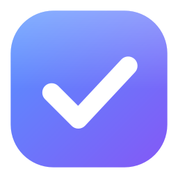
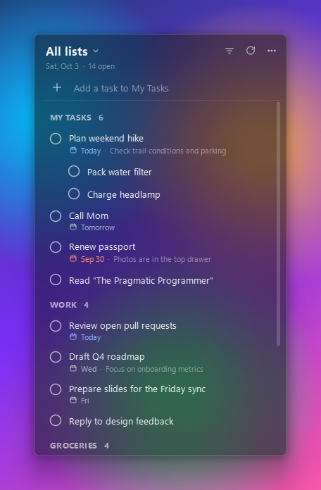
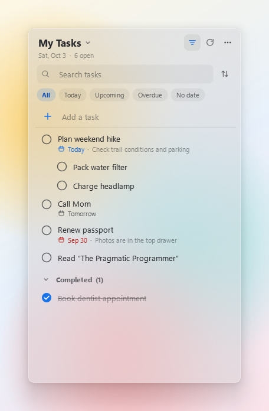
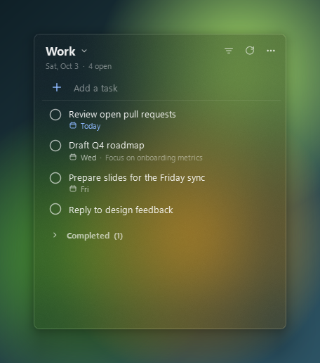

<p align="center">
  
</p>

<h1 align="center">GTask Widget</h1>

<p align="center">
  Your Google Tasks as a minimal glass widget on the Windows desktop.<br>
  See, check off and add tasks without opening a browser tab.
</p>

<p align="center">
  <a href="https://github.com/wangyz1999/gtask-widget/releases/latest"><b>⬇ Download for Windows</b></a>
  &nbsp;·&nbsp; <a href="#features">Features</a>
  &nbsp;·&nbsp; <a href="#using-the-widget">Using it</a>
  &nbsp;·&nbsp; <a href="#build-from-source">Build from source</a>
  &nbsp;·&nbsp; <a href="PRIVACY.md">Privacy</a>
</p>

<p align="center">
  <a href="https://github.com/wangyz1999/gtask-widget/actions/workflows/ci.yml"></a>
  <a href="https://github.com/wangyz1999/gtask-widget/releases/latest"></a>
  <a href="LICENSE"></a>
</p>

<p align="center">
  
  &nbsp;
  
</p>

## Features

- **Lives on your desktop.** It sits on the wallpaper layer, behind your windows, and stays visible when you press <kbd>Win</kbd>+<kbd>D</kbd> (Show desktop). You can also pin it always on top.
- **Readable on any wallpaper.** Frosted acrylic glass (blur on Windows 10) plus a tint keeps text legible on bright or busy backgrounds. Choose dark, light, or match Windows, and one of three glass levels.
- **Full task management.** Check off, add, rename, add subtasks, set due dates, edit notes, and delete with undo. Every change syncs to Google Tasks right away, so the Google Tasks app on your phone stays up to date.
- **Lists and filters.** Show all lists grouped, or just one. Filter by Today, Upcoming, Overdue or No date. Search titles and notes. Sort by your own order or by due date.
- **Lightweight.** About 60 MB of RAM, no CPU use while idle, no background services. Starts instantly from an encrypted local cache and still shows your tasks when you're offline.
- **Private by design.** It talks only to Google. There are no servers, analytics or telemetry. Your sign-in token is encrypted with Windows DPAPI. See [PRIVACY.md](PRIVACY.md).

<p align="center">
  
</p>

## Install

1. Download **`GTaskWidget-Setup-<version>.exe`** from the [latest release](https://github.com/wangyz1999/gtask-widget/releases/latest).
   There's also a portable `.zip`: unzip it anywhere and run `GTaskWidget.exe`.
2. Run the installer. It installs for your user only and doesn't need admin rights. You can choose to start the widget with Windows.
3. Click **Connect Google account**, then approve access in the browser window that opens. That's it.

> [!NOTE]
> **"Windows protected your PC"**: the app isn't code-signed yet, so SmartScreen may warn on first run. Click **More info → Run anyway**.
>
> **"Google hasn't verified this app"**: you may see this while the app's Google verification is pending. Click **Advanced → Go to GTask Widget**. The app only asks for access to Google Tasks, and the code that uses it is right here.

Requires Windows 10 or 11 (64-bit). Windows 11 gives the best glass effect.

## Using the widget

| To… | Do this |
| --- | --- |
| Move it | Drag an empty part of the header |
| Resize it | Drag any edge or corner |
| Complete a task | Click the circle (subtasks complete with their parent) |
| Add a task | Type in **Add a task** and press <kbd>Enter</kbd>. <kbd>Ctrl</kbd>+<kbd>N</kbd> jumps there |
| Rename | Double-click the task |
| Set a due date | Hover and click the calendar icon, or right-click and choose **Due date** |
| Edit notes and details | Right-click and choose **Edit details…** |
| Add a subtask | Right-click and choose **Add subtask** |
| Delete | Hover and click the trash icon. **Undo** appears for a few seconds |
| Switch lists | Click the list name at the top (or a section heading in **All lists**) |
| Filter or search | Click the filter icon or press <kbd>Ctrl</kbd>+<kbd>F</kbd>. <kbd>Esc</kbd> closes it |
| Refresh | <kbd>F5</kbd>. It also refreshes automatically every 5 minutes |
| Show or hide | Click the tray icon |

When the **Today** filter is on, new tasks are due today automatically.

**Settings** live in the **⋯** menu:

- **Theme**: Dark, Light or Match Windows
- **Glass**: Clear, Balanced or Frosted, and Blur background on or off
- **Placement**: On desktop or Always on top, Lock position, Reset position
- **Refresh every**: 1, 5, 15 or 30 minutes
- **Start with Windows**
- **Sign out**: removes the token and cache from this PC and revokes access

## Privacy & security

- Sign-in uses Google's OAuth 2.0 for desktop apps: a loopback redirect with PKCE, in your normal browser. The app never sees your password.
- The only permission requested is `https://www.googleapis.com/auth/tasks`.
- The token and task cache are stored in `%APPDATA%\GTaskWidget`, encrypted with Windows DPAPI so only your Windows account can read them.
- Network traffic goes only to Google (`accounts.google.com`, `oauth2.googleapis.com`, `tasks.googleapis.com`).
- Full policy: [PRIVACY.md](PRIVACY.md).

Release builds include this project's OAuth **client ID and client secret**. For installed desktop apps, Google [doesn't treat that secret as confidential](https://developers.google.com/identity/protocols/oauth2/native-app). It identifies the app, not you. It is not stored in this repository; CI adds it at build time.

## Build from source

You need Windows 10/11 and Python 3.10+.

```powershell
git clone https://github.com/wangyz1999/gtask-widget.git
cd gtask-widget
python -m venv .venv
.venv\Scripts\activate
pip install -r requirements-dev.txt

python -m gtask_widget --demo   # try it with sample tasks, no account needed
python -m gtask_widget          # the real thing
```

### Create your own Google OAuth client

Source builds don't include the project's OAuth client, so you need your own. It's free and takes about 5 minutes:

1. Open [Google Cloud Console](https://console.cloud.google.com/) and create a project.
2. Go to **APIs & Services → Library** and enable the **Google Tasks API**.
3. Go to **Google Auth Platform → Branding** and fill in an app name and support email. The name can't contain "Google".
4. Under **Audience**, choose **External**, then either add your Google account as a **test user** or click **Publish app**.
   While the app is in *Testing* status, Google expires sign-ins after 7 days. Publishing avoids that.
5. Go to **Clients → Create client**, choose **Desktop app**, and download the JSON file.
6. Start the widget and click **Choose client_secret.json…**. It's copied to `%APPDATA%\GTaskWidget\client_secret.json`.
   Alternatively, set the `GTASK_WIDGET_CLIENT_SECRETS` environment variable to the file's path.

### Test and package

```powershell
python -m pytest                                        # unit tests (Google is faked locally)
python tools\screenshot.py assets\screenshot-dark.png   # README screenshots from demo data
pyinstaller packaging\gtask_widget.spec --noconfirm     # -> dist\GTaskWidget\GTaskWidget.exe
iscc /DAppVersion=0.1.0 packaging\installer.iss         # -> dist\GTaskWidget-Setup-0.1.0.exe (Inno Setup 6)
```

## Releasing (maintainers)

1. **One-time setup:** store the project's OAuth client as a repository secret (it never goes into git):
   ```powershell
   gh secret set GOOGLE_OAUTH_CLIENT_JSON --repo wangyz1999/gtask-widget < path\to\client_secret.json
   ```
2. Bump `__version__` in `gtask_widget/__init__.py` and add a section to `CHANGELOG.md`.
3. Tag and push:
   ```powershell
   git tag v0.1.0
   git push origin v0.1.0
   ```
   The [Release workflow](.github/workflows/release.yml) runs the tests, builds the app with the client bundled, smoke-tests the `.exe`, packages the installer and portable zip with SHA-256 checksums, and publishes a GitHub release.

## Project layout

```
gtask_widget/
  app.py          entry point: single instance, tray icon
  auth.py         OAuth 2.0 loopback + PKCE, token refresh (stdlib only)
  api.py          Google Tasks REST client (stdlib only)
  backend.py      state, background sync, optimistic updates, offline cache
  models.py       tasks, due dates, filtering and sorting
  storage.py      settings and DPAPI-encrypted files
  demo.py         in-memory sample data for --demo
  ui/
    window.py     the widget: header, filter bar, list, sign-in screens
    task_row.py   a task row
    widgets.py    icon buttons, checkbox, menus, date picker, toast
    dialogs.py    edit-details and prompt dialogs
    theme.py      palettes and stylesheet
    icons.py      SVG line icons and the app icon
    winfx.py      Windows acrylic, rounded corners, desktop pinning, autostart
packaging/        PyInstaller spec, Inno Setup script, icon generator
tools/            screenshot generator
tests/            unit tests with a local fake of Google's APIs
```

The only runtime dependency is **PySide6** (Qt). Networking, OAuth and encryption use the Python standard library and Windows APIs.

## Troubleshooting

- **The widget disappeared.** Click the tray icon, or use **⋯ → Placement → Reset position**.
- **No blur.** Windows' **Settings → Personalization → Colors → Transparency effects** must be on. Battery saver can also turn it off. The widget falls back to a denser tint.
- **"Your Google sign-in expired."** Sign in again. If this happens weekly with your own OAuth client, it's still in *Testing* status (see above).
- **Logs** are in `%APPDATA%\GTaskWidget\gtask-widget.log`. They never contain task content or tokens.
- **macOS/Linux:** it runs from source, but blur, desktop pinning and autostart are Windows-only.

## Contributing

Issues and pull requests are welcome. Please run `python -m pytest` before opening a PR, and keep the UI minimal: new options belong in the **⋯** menu, not in the main view.

## License

[MIT](LICENSE). GTask Widget is an independent project. It is not affiliated with or endorsed by Google. Google Tasks is a trademark of Google LLC.
